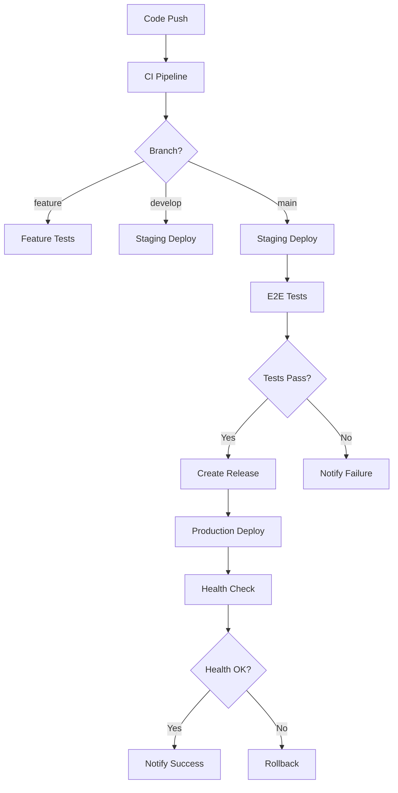

# CI/CD パイプライン設定ガイド - CAN異常検出管理システム

## 概要

このドキュメントでは、CAN異常検出管理システムのCI/CDパイプライン設定について説明します。GitHub ActionsとAzure DevOpsの両方に対応しています。

## アーキテクチャ

```
┌─────────────────┐    ┌─────────────────┐    ┌─────────────────┐
│   Source Code   │    │   CI Pipeline   │    │  CD Pipeline    │
│   (GitHub)      │───►│  (Build/Test)   │───►│   (Deploy)      │
└─────────────────┘    └─────────────────┘    └─────────────────┘
         │                       │                       │
         │                       ▼                       ▼
         │              ┌─────────────────┐    ┌─────────────────┐
         │              │ Security Scan   │    │   Staging       │
         │              │ Quality Gate    │    │   Production    │
         │              └─────────────────┘    └─────────────────┘
         │
         ▼
┌─────────────────┐
│ Automated       │
│ Dependencies    │
│ Update          │
└─────────────────┘
```

## GitHub Actions 設定

### 1. メインCI/CDパイプライン (.github/workflows/ci-cd.yml)

#### トリガー条件
- **Push**: `main`, `develop` ブランチ
- **Pull Request**: `main` ブランチ向け
- **Release**: リリース作成時

#### ジョブ構成

##### Backend Build & Test
```yaml
- バックエンドビルド
- 単体テスト実行
- コードカバレッジ測定
- セキュリティスキャン
```

##### Frontend Build & Test
```yaml
- フロントエンドビルド
- 単体テスト実行
- Linting実行
- コードカバレッジ測定
```

##### E2E Test
```yaml
- Docker Compose でアプリケーション起動
- Cypress E2Eテスト実行
- テスト結果レポート生成
```

##### Security Scan
```yaml
- Trivy脆弱性スキャン
- .NET セキュリティ監査
- Node.js セキュリティ監査
```

##### Build Images
```yaml
- Docker イメージビルド
- Container Registry へプッシュ
- イメージタグ管理
```

##### Deploy
```yaml
- ステージング環境デプロイ (main ブランチ)
- 本番環境デプロイ (リリース時)
- ヘルスチェック実行
```

### 2. セキュリティスキャン (.github/workflows/security-scan.yml)

#### 実行スケジュール
- **定期実行**: 毎日午前2時
- **手動実行**: workflow_dispatch

#### スキャン内容
- .NET 依存関係脆弱性チェック
- Node.js 依存関係脆弱性チェック
- Docker イメージ脆弱性スキャン
- ファイルシステムスキャン
- OWASP Dependency Check

### 3. 依存関係更新 (.github/workflows/dependency-update.yml)

#### 実行スケジュール
- **定期実行**: 毎週月曜日午前9時
- **手動実行**: workflow_dispatch

#### 更新内容
- .NET NuGet パッケージ更新
- Node.js npm パッケージ更新
- Docker ベースイメージ更新
- 自動プルリクエスト作成

## Azure DevOps 設定

### 1. パイプライン設定 (azure-pipelines.yml)

#### ステージ構成

##### Build Stage
```yaml
- Backend Build & Test
- Frontend Build & Test
- Security Scan
- アーティファクト発行
```

##### E2E Test Stage
```yaml
- Docker Compose 起動
- E2Eテスト実行
- 結果レポート生成
```

##### Build Images Stage
```yaml
- Azure Container Registry ログイン
- Docker イメージビルド・プッシュ
- イメージタグ管理
```

##### Deploy Staging Stage
```yaml
- Azure Container Instances デプロイ
- ヘルスチェック実行
```

##### Deploy Production Stage
```yaml
- Azure Kubernetes Service デプロイ
- ローリングアップデート実行
- 通知送信
```

## 環境設定

### GitHub Actions Secrets

#### 必須シークレット
```bash
# Container Registry
GITHUB_TOKEN                 # GitHub Container Registry アクセス

# 本番環境デプロイ
PROD_HOST                   # 本番サーバーホスト
PROD_USERNAME               # SSH ユーザー名
PROD_SSH_KEY                # SSH 秘密鍵

# ステージング環境デプロイ
STAGING_HOST                # ステージングサーバーホスト
STAGING_USERNAME            # SSH ユーザー名
STAGING_SSH_KEY             # SSH 秘密鍵

# 通知
SLACK_WEBHOOK               # Slack Webhook URL
SLACK_SECURITY_WEBHOOK      # セキュリティ通知用 Slack Webhook
```

#### オプションシークレット
```bash
# コードカバレッジ
CODECOV_TOKEN               # Codecov アップロード用

# セキュリティスキャン
SNYK_TOKEN                  # Snyk セキュリティスキャン用
```

### Azure DevOps Variables

#### Variable Groups
```yaml
# anomaly-detection-common
DOTNET_VERSION: '10.0.x'
NODE_VERSION: '18.x'
BUILD_CONFIGURATION: 'Release'

# anomaly-detection-staging
STAGING_CONNECTION_STRING: '$(STAGING_DB_CONNECTION)'
STAGING_RESOURCE_GROUP: 'anomaly-detection-staging'

# anomaly-detection-production  
PROD_CONNECTION_STRING: '$(PROD_DB_CONNECTION)'
PROD_RESOURCE_GROUP: 'anomaly-detection-prod'
PROD_AKS_CLUSTER: 'anomaly-detection-aks'
```

#### Service Connections
```yaml
# Container Registry
anomaly-detection-acr       # Azure Container Registry

# Azure Subscription
anomaly-detection-subscription

# Notification
slack-webhook               # Slack 通知用
```

## デプロイメント戦略

### 1. ブランチ戦略

```
main ────────────────────────────────► Production
  │
  ├─ develop ──────────────────────────► Staging
  │
  ├─ feature/xxx ──────────────────────► Feature Testing
  │
  └─ hotfix/xxx ───────────────────────► Hotfix Testing
```

### 2. 環境構成

#### Development (開発環境)
- **トリガー**: feature ブランチ プッシュ
- **デプロイ先**: 開発者ローカル環境
- **データベース**: LocalDB / Docker SQL Server
- **設定**: 開発用設定、デバッグ有効

#### Staging (ステージング環境)
- **トリガー**: main ブランチ プッシュ
- **デプロイ先**: Azure Container Instances
- **データベース**: Azure SQL Database (Staging)
- **設定**: 本番類似設定、ログ詳細

#### Production (本番環境)
- **トリガー**: リリースタグ作成
- **デプロイ先**: Azure Kubernetes Service
- **データベース**: Azure SQL Database (Production)
- **設定**: 本番設定、パフォーマンス最適化

### 3. デプロイメントフロー



## 品質ゲート

### 1. コード品質基準

#### Backend (.NET)
```yaml
- ビルド成功率: 100%
- 単体テスト成功率: 100%
- コードカバレッジ: ≥ 80%
- セキュリティ脆弱性: Critical/High = 0
- 静的解析: Warning 以下
```

#### Frontend (Angular)
```yaml
- ビルド成功率: 100%
- 単体テスト成功率: 100%
- コードカバレッジ: ≥ 75%
- Linting: Error = 0
- セキュリティ脆弱性: Critical/High = 0
```

#### E2E Tests
```yaml
- E2Eテスト成功率: 100%
- パフォーマンステスト: 応答時間 < 3秒
- アクセシビリティテスト: WCAG 2.1 AA準拠
```

### 2. セキュリティ基準

```yaml
- 脆弱性スキャン: Critical = 0, High ≤ 2
- 依存関係監査: 既知脆弱性 = 0
- コンテナスキャン: Critical = 0
- 静的セキュリティ分析: 合格
```

## 監視・アラート

### 1. パイプライン監視

#### メトリクス
- ビルド成功率
- テスト成功率
- デプロイ成功率
- 平均ビルド時間
- 平均デプロイ時間

#### アラート条件
```yaml
- ビルド失敗: 即座に通知
- テスト失敗: 即座に通知
- デプロイ失敗: 即座に通知
- セキュリティ脆弱性検出: 1時間以内に通知
- 品質ゲート失敗: 即座に通知
```

### 2. 通知設定

#### Slack 通知
```yaml
- チャンネル: #ci-cd
- 通知内容:
  - ビルド結果
  - デプロイ結果
  - セキュリティアラート
  - 品質メトリクス
```

#### Email 通知
```yaml
- 対象者: 開発チーム、DevOpsチーム
- 通知内容:
  - 本番デプロイ完了
  - セキュリティインシデント
  - システム障害
```

## トラブルシューティング

### よくある問題と解決方法

#### 1. ビルド失敗
```bash
# 依存関係の問題
- NuGet パッケージ復元エラー
  → パッケージソース設定確認
  → キャッシュクリア実行

- Node.js 依存関係エラー
  → yarn.lock ファイル確認
  → node_modules 削除・再インストール
```

#### 2. テスト失敗
```bash
# 単体テスト失敗
- データベース接続エラー
  → 接続文字列確認
  → テスト用データベース起動確認

# E2Eテスト失敗
- アプリケーション起動エラー
  → Docker Compose ログ確認
  → ポート競合確認
```

#### 3. デプロイ失敗
```bash
# コンテナデプロイ失敗
- イメージプル失敗
  → レジストリ認証確認
  → ネットワーク接続確認

# ヘルスチェック失敗
- アプリケーション起動遅延
  → タイムアウト時間延長
  → リソース制限確認
```

### ログ確認方法

#### GitHub Actions
```bash
# ワークフローログ確認
https://github.com/{owner}/{repo}/actions

# 特定ジョブのログ
https://github.com/{owner}/{repo}/actions/runs/{run_id}

# アーティファクトダウンロード
Actions → Workflow Run → Artifacts
```

#### Azure DevOps
```bash
# パイプライン実行履歴
https://dev.azure.com/{org}/{project}/_build

# 詳細ログ確認
Pipeline → Run → Job → Task

# テスト結果確認
Pipeline → Run → Tests → Results
```

## パフォーマンス最適化

### 1. ビルド時間短縮

#### キャッシュ活用
```yaml
# NuGet パッケージキャッシュ
- ~/.nuget/packages

# Node.js モジュールキャッシュ  
- node_modules

# Docker レイヤーキャッシュ
- BuildKit キャッシュマウント使用
```

#### 並列実行
```yaml
# ジョブ並列実行
- Backend と Frontend を並列ビルド
- 複数テストスイートを並列実行

# マトリックス戦略
- 複数環境での並列テスト
- 複数ブラウザでのE2Eテスト並列実行
```

### 2. リソース最適化

#### GitHub Actions
```yaml
# ランナー選択
- ubuntu-latest: 標準ワークロード
- ubuntu-latest-4-cores: CPU集約的タスク
- windows-latest: Windows固有テスト

# ジョブタイムアウト設定
timeout-minutes: 30  # デフォルト360分から短縮
```

#### Azure DevOps
```yaml
# エージェントプール選択
- Microsoft-hosted: 標準ワークロード
- Self-hosted: カスタム要件

# リソース制限設定
demands:
  - Agent.OS -equals Linux
  - npm
```

## セキュリティベストプラクティス

### 1. シークレット管理

#### 原則
- シークレットはコードに含めない
- 環境変数で管理
- 最小権限の原則
- 定期的なローテーション

#### 実装
```yaml
# GitHub Actions
secrets:
  DB_PASSWORD: ${{ secrets.DB_PASSWORD }}

# Azure DevOps
variables:
  - group: security-variables
  - name: dbPassword
    value: $(DB_PASSWORD)
```

### 2. アクセス制御

#### GitHub
```yaml
# ブランチ保護ルール
- main ブランチへの直接プッシュ禁止
- プルリクエスト必須
- レビュー承認必須
- ステータスチェック必須

# 環境保護ルール
- 本番環境デプロイ承認必須
- 承認者指定
- デプロイ時間制限
```

#### Azure DevOps
```yaml
# ブランチポリシー
- 最小レビュー数: 2
- ビルド検証必須
- 作業項目リンク必須

# 環境承認
- 本番環境: 手動承認必須
- ステージング環境: 自動承認
```

## 参考リンク

### 公式ドキュメント
- [GitHub Actions](https://docs.github.com/en/actions)
- [Azure DevOps](https://docs.microsoft.com/en-us/azure/devops/)
- [Docker](https://docs.docker.com/)
- [Kubernetes](https://kubernetes.io/docs/)

### ツール・サービス
- [Trivy](https://trivy.dev/) - 脆弱性スキャナー
- [OWASP Dependency Check](https://owasp.org/www-project-dependency-check/)
- [Codecov](https://codecov.io/) - コードカバレッジ
- [Slack](https://slack.com/) - 通知サービス

### ベストプラクティス
- [12-Factor App](https://12factor.net/)
- [GitOps](https://www.gitops.tech/)
- [DevSecOps](https://www.devsecops.org/)
- [Site Reliability Engineering](https://sre.google/)